# Manual de Implementación: Sistema de Background Jobs en Gingga

**Autor**: Claude  
**Fecha**: 9 de Septiembre, 2025  
**Versión**: 1.1  
**Audiencia**: Desarrolladores Backend, DevOps, SysAdmins  
**Última actualización**: Agregada sección completa de monitoreo para SolidQueue con scripts automatizados  

---

## 📋 Tabla de Contenidos

1. [Resumen Ejecutivo](#resumen-ejecutivo)
2. [Arquitectura Actual del Sistema](#arquitectura-actual-del-sistema)
3. [Flujo Detallado de Jobs](#flujo-detallado-de-jobs)
4. [Problemas Identificados](#problemas-identificados)
5. [Replicación Manual de Jobs](#replicación-manual-de-jobs)
6. [Monitoring y Troubleshooting de SolidQueue](#monitoring-y-troubleshooting-de-solidqueue)
7. [Implementación de Sidekiq](#implementación-de-sidekiq)
8. [Monitoring y Troubleshooting](#monitoring-y-troubleshooting)
9. [Testing y Validación](#testing-y-validación)
10. [Runbook de Operaciones](#runbook-de-operaciones)

---

## Resumen Ejecutivo

El sistema de background jobs de Gingga procesa la generación de estrategias de contenido en dos fases principales:

1. **Noctua Strategy Generation**: Genera estrategias de contenido usando IA
2. **Voxa Content Refinement**: Refina y mejora el contenido generado

Actualmente usa **SolidQueue** como adapter de jobs, pero tiene problemas de confiabilidad debido a la falta de workers corriendo. Este documento detalla el funcionamiento actual y propone la migración a **Sidekiq** para mayor robustez.

---

## Arquitectura Actual del Sistema

### Stack Tecnológico

```ruby
# Gemfile
gem 'solid_queue'           # Background jobs (actual)
gem 'activejob'            # Rails job framework
gem 'pg'                   # PostgreSQL para persistencia
```

### Componentes Principales

```
┌─────────────────┐    ┌──────────────────┐    ┌─────────────────┐
│   Controllers   │───▶│   Service Layer  │───▶│  Background     │
│                 │    │                  │    │  Jobs           │
│ - Planning      │    │ - NoctuaService  │    │ - NoctuaBatch   │
│ - Strategist    │    │ - VoxaService    │    │ - VoxaBatch     │
└─────────────────┘    └──────────────────┘    └─────────────────┘
                                                        │
                                                        ▼
┌─────────────────┐    ┌──────────────────┐    ┌─────────────────┐
│   Database      │◀───│   Data Models    │◀───│  Job Queue      │
│                 │    │                  │    │                 │
│ - PostgreSQL    │    │ - StrategyPlan   │    │ - SolidQueue    │
│ - SolidQueue    │    │ - ContentItem    │    │ - Jobs Table    │
│   Tables        │    │ - AiResponse     │    │                 │
└─────────────────┘    └──────────────────┘    └─────────────────┘
```

### Configuración Actual

```ruby
# config/application.rb
config.active_job.queue_adapter = :solid_queue

# config/database.yml - SolidQueue usa la misma DB que Rails
default: &default
  adapter: postgresql
  encoding: unicode
  pool: <%= ENV.fetch("RAILS_MAX_THREADS") { 5 } %>
  # SolidQueue tables: solid_queue_jobs, solid_queue_ready_executions, etc.
```

---

## Flujo Detallado de Jobs

### 1. Generación de Estrategia Noctua

#### Flujo Completo


#### Código del Servicio Principal

```ruby
# app/services/creas/noctua_strategy_service.rb
module Creas
  class NoctuaStrategyService
    def call
      # 1. Crear plan inicial
      strategy_plan = CreasStrategyPlan.create!(
        user: @user,
        brand: @brand, 
        month: @month,
        status: :pending  # Estado inicial
      )

      # 2. Calcular batches necesarios (siempre 4 semanas)
      total_batches = 4
      batch_id = SecureRandom.uuid

      # 3. Encolar primer batch job
      ::GenerateNoctuaStrategyBatchJob.perform_later(
        strategy_plan.id, 
        @brief, 
        1,              # batch_number
        total_batches,  # total_batches
        batch_id        # batch_id para tracking
      )

      strategy_plan # Retorna inmediatamente con status: pending
    end
  end
end
```

#### Job de Procesamiento por Batches

```ruby
# app/jobs/generate_noctua_strategy_batch_job.rb
class GenerateNoctuaStrategyBatchJob < ApplicationJob
  def perform(strategy_plan_id, brief, batch_number, total_batches, batch_id)
    strategy_plan = CreasStrategyPlan.find(strategy_plan_id)
    
    # 1. Marcar como processing en el primer batch
    if batch_number == 1 && strategy_plan.status == "pending"
      strategy_plan.update!(status: :processing)
    end

    # 2. Generar prompt específico para esta semana
    system_prompt = build_batch_system_prompt(batch_number, total_batches)
    user_prompt = build_batch_user_prompt(brief, batch_number, total_batches, strategy_plan)

    # 3. Llamar a OpenAI API
    json = GinggaOpenAI::ChatClient.new(
      user: strategy_plan.user,
      model: "gpt-4o",
      temperature: 0.4
    ).chat!(system: system_prompt, user: user_prompt)

    # 4. Parsear y almacenar respuesta
    parsed = JSON.parse(json)
    process_batch_results(strategy_plan, parsed, batch_number, total_batches, batch_id)

    # 5. Continuar con siguiente batch o finalizar
    if batch_number == total_batches
      finalize_strategy_plan(strategy_plan, batch_id)
    else
      queue_next_batch(strategy_plan_id, brief, batch_number + 1, total_batches, batch_id)
    end
  end

  private

  def finalize_strategy_plan(strategy_plan, batch_id)
    # Ensamblar weekly_plan de todos los batches
    weekly_plan = assemble_weekly_plan_from_batches(strategy_plan)
    
    # Actualizar strategy plan
    strategy_plan.update!(
      status: :completed,
      weekly_plan: weekly_plan,
      # ... otros campos
    )

    # ✅ NUEVO: Crear content items automáticamente
    initialize_content_items(strategy_plan)
  end

  def initialize_content_items(strategy_plan)
    service = Creas::ContentItemInitializerService.new(strategy_plan: strategy_plan)
    created_items = service.call
    Rails.logger.info "Created #{created_items.count} content items automatically"
  end
end
```

### 2. Refinamiento con Voxa

#### Flujo de Voxa


#### Código del Servicio Voxa

```ruby
# app/services/creas/voxa_content_service.rb
module Creas
  class VoxaContentService
    def call
      # 1. Validaciones
      raise StandardError, "Content refinement already in progress" if @plan.status == "processing"
      
      # 2. Calcular batches necesarios (máx 7 items por batch)
      content_count = @plan.creas_content_items.count
      total_batches = (content_count.to_f / 7).ceil
      
      # 3. Actualizar status y encolar primer batch
      @plan.update!(status: :pending)
      ::GenerateVoxaContentBatchJob.perform_later(@plan.id, 1, total_batches, batch_id)
      
      @plan
    end
  end
end
```

#### Job de Refinamiento por Batches

```ruby
# app/jobs/generate_voxa_content_batch_job.rb
class GenerateVoxaContentBatchJob < ApplicationJob
  def perform(strategy_plan_id, batch_number, total_batches, batch_id)
    strategy_plan = CreasStrategyPlan.find(strategy_plan_id)
    
    # 1. Obtener items para este batch (máximo 7)
    content_items = get_content_items_for_batch(strategy_plan, batch_number, total_batches)
    
    # 2. Marcar items como in_progress
    content_items.update_all(
      status: "in_progress",
      batch_number: batch_number
    )

    # 3. Preparar datos para IA
    strategy_plan_data = Creas::StrategyPlanFormatter.new(strategy_plan).for_voxa_batch(content_items)
    
    # 4. Generar prompts
    system_msg = build_batch_system_prompt(strategy_plan_data, batch_number, total_batches)
    user_msg = build_batch_user_prompt(strategy_plan_data, brand_context, existing_content_context, batch_number)

    # 5. Llamar a OpenAI
    response = GinggaOpenAI::ChatClient.new(
      user: strategy_plan.user,
      model: "gpt-4o-mini", 
      temperature: 0.5
    ).chat!(system: system_msg, user: user_msg)

    # 6. Procesar respuesta y actualizar items
    parsed_response = JSON.parse(response)
    voxa_items = parsed_response.fetch("items")
    
    processed_count = process_voxa_batch_items(strategy_plan, voxa_items, content_items, batch_number)

    # 7. Continuar o finalizar
    if batch_number == total_batches
      finalize_voxa_processing(strategy_plan, batch_id)
    else
      queue_next_batch(strategy_plan_id, batch_number + 1, total_batches, batch_id)
    end
  end

  private

  def process_voxa_batch_items(strategy_plan, voxa_items, content_items, batch_number)
    processed_items = []

    CreasContentItem.transaction do
      voxa_items.each do |item|
        processed_item = upsert_voxa_batch_item(strategy_plan, item, content_items, batch_number)
        processed_items << processed_item if processed_item&.persisted?
      end
    end

    processed_items.count
  end

  def upsert_voxa_batch_item(strategy_plan, item, content_items, batch_number)
    # Encontrar item existente
    rec = find_existing_content_item_in_batch(content_items, item["origin_id"], item["id"])
    
    if rec&.persisted?
      # Actualizar item existente a in_production
      update_existing_batch_item(rec, attrs, item, batch_number)
    else
      # Crear nuevo item (caso edge)
      create_new_batch_item(strategy_plan, attrs, batch_number)
    end
  end
end
```

### 3. Estados de los Content Items

#### Diagrama de Estados

```mermaid
stateDiagram-v2
    [*] --> draft: ContentItemInitializerService
    draft --> in_progress: VoxaBatchJob starts processing
    in_progress --> in_production: VoxaBatchJob completes successfully
    in_progress --> draft: Error recovery
    in_production --> [*]: Final state
    
    note right of in_progress
      ⚠️ PROBLEMA: Items pueden
      quedarse atascados aquí
      si el job falla
    end note
```



#### Estados Detallados

| Estado | Descripción | Cuándo Ocurre | Siguiente Estado |
|--------|-------------|---------------|------------------|
| `draft` | Item creado pero no procesado por Voxa | Después de Noctua completion | `in_progress` |
| `in_progress` | Item siendo procesado por Voxa | Al iniciar VoxaBatchJob | `in_production` |
| `in_production` | Item completamente refinado | Al finalizar VoxaBatchJob | Final |

---

## Problemas Identificados

### 1. Workers de SolidQueue No Ejecutándose

#### Síntomas
```bash
# Verificación que muestra el problema
$ ps aux | grep solid_queue
# Resultado: Vacío (no hay workers corriendo)

$ rails runner "puts SolidQueue::Job.where(finished_at: nil).count"
# Resultado: > 0 (hay jobs pendientes sin procesar)
```

#### Causa Raíz
- SolidQueue requiere workers separados para procesar jobs
- En desarrollo, no se inician automáticamente
- Los jobs se encolan pero nunca se ejecutan

### 2. Estados Intermedios Persistentes

#### Problema de Transacciones
```ruby
# En process_voxa_batch_items
CreasContentItem.transaction do
  voxa_items.each do |item|
    # Si falla aquí, algunos items quedan in_progress
    processed_item = upsert_voxa_batch_item(...)
  end
end
```

#### Problema de Matching de Items
```ruby
def find_existing_content_item_in_batch(content_items, origin_id, content_id)
  # Si ninguna condición hace match, retorna nil
  return content_items.find { |item| item.content_id == origin_id } if origin_id.present?
  return content_items.find { |item| item.origin_id == origin_id } if origin_id.present?  
  return content_items.find { |item| item.content_id == content_id } if content_id.present?
  nil # ⚠️ Item queda in_progress si no encuentra match
end
```

### 3. Falta de Robustez en Recuperación

#### Sin Safeguards Originales
- No había verificación de items atascados en `in_progress`
- No había recuperación automática en `finalize_voxa_processing`
- No había alertas sobre jobs fallidos

---

## Replicación Manual de Jobs

### Escenario 1: Generar Estrategia Noctua Manualmente

#### Paso 1: Preparar Datos
```ruby
# En rails console
user = User.first
brand = user.brands.first
month = "2025-12"
brief = "Generate social media strategy for December 2025"
```

#### Paso 2: Crear Strategy Plan
```ruby
strategy_plan = CreasStrategyPlan.create!(
  user: user,
  brand: brand,
  month: month,
  status: :pending,
  brand_snapshot: {
    name: brand.name,
    industry: brand.industry,
    voice: brand.voice,
    # ... otros datos de brand
  }
)

puts "Created strategy plan: #{strategy_plan.id}"
```

#### Paso 3: Ejecutar Batches Manualmente
```ruby
# Batch 1
batch_id = SecureRandom.uuid
GenerateNoctuaStrategyBatchJob.perform_now(strategy_plan.id, brief, 1, 4, batch_id)
puts "Completed batch 1"

# Batch 2  
GenerateNoctuaStrategyBatchJob.perform_now(strategy_plan.id, brief, 2, 4, batch_id)
puts "Completed batch 2"

# Batch 3
GenerateNoctuaStrategyBatchJob.perform_now(strategy_plan.id, brief, 3, 4, batch_id)
puts "Completed batch 3"

# Batch 4 (final)
GenerateNoctuaStrategyBatchJob.perform_now(strategy_plan.id, brief, 4, 4, batch_id)
puts "Completed batch 4"

# Verificar resultado
strategy_plan.reload
puts "Final status: #{strategy_plan.status}"
puts "Content items created: #{strategy_plan.creas_content_items.count}"
```

#### Paso 4: Script de Automatización
```ruby
# scripts/generate_noctua_manual.rb
#!/usr/bin/env ruby

def generate_noctua_strategy(user_id, brand_id, month, brief)
  user = User.find(user_id)
  brand = Brand.find(brand_id)
  
  puts "=== MANUAL NOCTUA GENERATION ==="
  puts "User: #{user.email}"
  puts "Brand: #{brand.name}"
  puts "Month: #{month}"
  
  # Usar el servicio normal
  service = Creas::NoctuaStrategyService.new(
    user: user, 
    brand: brand, 
    month: month, 
    brief: brief
  )
  
  strategy_plan = service.call
  puts "Strategy plan created: #{strategy_plan.id} (status: #{strategy_plan.status})"
  
  # Ejecutar batches manualmente
  batch_id = SecureRandom.uuid
  
  (1..4).each do |batch_number|
    puts "Processing batch #{batch_number}/4..."
    begin
      GenerateNoctuaStrategyBatchJob.perform_now(
        strategy_plan.id, 
        brief, 
        batch_number, 
        4, 
        batch_id
      )
      puts "✅ Batch #{batch_number} completed"
    rescue => e
      puts "❌ Batch #{batch_number} failed: #{e.message}"
      break
    end
  end
  
  strategy_plan.reload
  puts "\n=== FINAL RESULTS ==="
  puts "Status: #{strategy_plan.status}"
  puts "Weekly plan present: #{strategy_plan.weekly_plan.present?}"
  puts "Content items: #{strategy_plan.creas_content_items.count}"
  puts "URL: http://localhost:3000/planning?plan_id=#{strategy_plan.id}"
  
  strategy_plan
end

# Uso:
# rails runner scripts/generate_noctua_manual.rb
# generate_noctua_strategy(1, 1, "2025-12", "December strategy")
```

### Escenario 2: Procesar Voxa Manualmente

#### Paso 1: Preparar Strategy Plan con Content Items
```ruby
# Asumiendo que ya tienes un strategy_plan con content items
strategy_plan = CreasStrategyPlan.find("your-plan-id")
puts "Content items: #{strategy_plan.creas_content_items.count}"
puts "Status breakdown: #{strategy_plan.creas_content_items.group(:status).count}"
```

#### Paso 2: Ejecutar Voxa Batches
```ruby
# Calcular batches necesarios
total_items = strategy_plan.creas_content_items.count
batch_size = 7
total_batches = (total_items.to_f / batch_size).ceil

puts "Will process #{total_items} items in #{total_batches} batches"

batch_id = SecureRandom.uuid

# Ejecutar cada batch
(1..total_batches).each do |batch_number|
  puts "Processing Voxa batch #{batch_number}/#{total_batches}..."
  
  begin
    GenerateVoxaContentBatchJob.perform_now(
      strategy_plan.id,
      batch_number,
      total_batches, 
      batch_id
    )
    puts "✅ Batch #{batch_number} completed"
    
    # Verificar progreso
    current_statuses = strategy_plan.creas_content_items.group(:status).count
    puts "   Current status: #{current_statuses}"
  rescue => e
    puts "❌ Batch #{batch_number} failed: #{e.message}"
    puts "   Error details: #{e.backtrace.first(3).join(', ')}"
    break
  end
end

# Resultados finales
strategy_plan.reload
puts "\n=== VOXA PROCESSING RESULTS ==="
puts "Plan status: #{strategy_plan.status}"
final_statuses = strategy_plan.creas_content_items.group(:status).count
puts "Final status breakdown: #{final_statuses}"

in_production = final_statuses["in_production"] || 0
total = strategy_plan.creas_content_items.count
puts "Success rate: #{(in_production.to_f / total * 100).round(1)}%"
```

#### Paso 3: Script de Recuperación para Plans Atascados
```ruby
# scripts/recover_stuck_plans.rb
#!/usr/bin/env ruby

def recover_stuck_plan(plan_id)
  plan = CreasStrategyPlan.find(plan_id)
  
  puts "=== RECOVERING STUCK PLAN ==="
  puts "Plan ID: #{plan.id}"
  puts "Current status: #{plan.status}"
  
  original_statuses = plan.creas_content_items.group(:status).count
  puts "Original breakdown: #{original_statuses}"
  
  # Fix stuck in_progress items
  stuck_items = plan.creas_content_items.where(status: 'in_progress')
  if stuck_items.exists?
    puts "Fixing #{stuck_items.count} stuck in_progress items..."
    stuck_items.update_all(status: 'in_production')
  end
  
  # Fix remaining draft items  
  draft_items = plan.creas_content_items.where(status: 'draft')
  if draft_items.exists?
    puts "Processing #{draft_items.count} remaining draft items..."
    
    # Option 1: Mark as in_production (quick fix)
    draft_items.update_all(status: 'in_production')
    
    # Option 2: Process through Voxa (proper fix)
    # process_draft_items_through_voxa(plan, draft_items)
  end
  
  # Update plan status
  plan.update!(
    status: 'completed',
    meta: (plan.meta || {}).merge(
      manual_recovery_applied: true,
      recovery_timestamp: Time.current,
      recovery_method: 'manual_script'
    )
  )
  
  puts "\n=== RECOVERY COMPLETE ==="
  puts "Plan status: #{plan.reload.status}"
  final_statuses = plan.creas_content_items.group(:status).count  
  puts "Final breakdown: #{final_statuses}"
  
  total_items = plan.creas_content_items.count
  in_production = final_statuses['in_production'] || 0
  puts "Success rate: #{(in_production.to_f / total_items * 100).round(1)}%"
  
  plan
end

# Uso:
# rails runner scripts/recover_stuck_plans.rb  
# recover_stuck_plan("your-plan-id")
```

---

## Monitoring y Troubleshooting de SolidQueue

### Comandos de Monitoreo Básico

#### Verificar Estado General de Jobs
```bash
# Ver resumen rápido de jobs pendientes
bundle exec rails runner "puts \"📋 Jobs pendientes: #{SolidQueue::Job.where(finished_at: nil).count}\""

# Ver jobs completados
bundle exec rails runner "puts \"✅ Jobs completados: #{SolidQueue::Job.where.not(finished_at: nil).count}\""

# Ver total de jobs en el sistema
bundle exec rails runner "puts \"📊 Total jobs: #{SolidQueue::Job.count}\""
```

#### Análisis Detallado de Jobs
```ruby
# Script completo para análisis de jobs
bundle exec rails runner "
puts '=== ANÁLISIS COMPLETO DE JOBS ==='

# Jobs pendientes (sin finished_at)
pending = SolidQueue::Job.where(finished_at: nil).count
puts \"📋 Jobs pendientes: #{pending}\"

# Jobs completados (con finished_at)
completed = SolidQueue::Job.where.not(finished_at: nil).count
puts \"✅ Jobs completados: #{completed}\"

# Jobs por tipo
puts \"\\n📊 Jobs por tipo:\"
SolidQueue::Job.group(:class_name).count.each do |job_class, count|
  puts \"  #{job_class}: #{count}\"
end

# Jobs pendientes detalles
puts \"\\n⏳ Jobs pendientes detalles:\"
SolidQueue::Job.where(finished_at: nil).limit(10).each do |job|
  puts \"  - #{job.class_name} (creado: #{job.created_at})\"
end

# Jobs programados para el futuro
future_jobs = SolidQueue::Job.where('scheduled_at > ?', Time.current).count
puts \"\\n⏰ Jobs programados para el futuro: #{future_jobs}\"

# Jobs antiguos pendientes (más de 1 día)
old_pending = SolidQueue::Job.where(finished_at: nil).where('created_at < ?', 1.day.ago).count
puts \"\\n⚠️  Jobs pendientes antiguos (>1 día): #{old_pending}\"
"
```

### Monitoreo de Jobs Específicos

#### CheckVideoStatusJob (HeyGen Integration)
```bash
# Ver jobs de video pendientes
bundle exec rails runner "
video_jobs = SolidQueue::Job.where(class_name: 'CheckVideoStatusJob', finished_at: nil)
puts \"🎥 CheckVideoStatusJob pendientes: #{video_jobs.count}\"
video_jobs.each { |job| puts \"  - Creado: #{job.created_at}\" }
"
```

#### Jobs de Generación de Contenido
```bash
# Noctua Strategy Jobs
bundle exec rails runner "
noctua_pending = SolidQueue::Job.where(class_name: 'GenerateNoctuaStrategyBatchJob', finished_at: nil).count
puts \"🧠 Noctua Strategy Jobs pendientes: #{noctua_pending}\"
"

# Voxa Content Jobs  
bundle exec rails runner "
voxa_pending = SolidQueue::Job.where(class_name: 'GenerateVoxaContentBatchJob', finished_at: nil).count
puts \"📝 Voxa Content Jobs pendientes: #{voxa_pending}\"
"
```

### Dashboard Web para SolidQueue

#### Configuración del Dashboard
```ruby
# config/routes.rb
require "solid_queue/web"

Rails.application.routes.draw do
  # Montar el dashboard de SolidQueue (solo en desarrollo/staging)
  if Rails.env.development? || Rails.env.staging?
    mount SolidQueue::Web => "/solid_queue"
  end
  
  # En producción, proteger con autenticación
  if Rails.env.production?
    authenticate :user, ->(user) { user.admin? } do
      mount SolidQueue::Web => "/solid_queue"
    end
  end
end
```

#### Acceso al Dashboard
```bash
# Visitar en el navegador:
# Desarrollo: http://localhost:3000/solid_queue
# Producción: https://yourdomain.com/solid_queue (requiere admin)
```

### Comandos de Limpieza y Mantenimiento

#### Limpiar Jobs Antiguos
```bash
# Eliminar jobs completados antiguos (más de 7 días)
bundle exec rails runner "
old_completed = SolidQueue::Job.where.not(finished_at: nil)
                                .where('finished_at < ?', 7.days.ago)
puts \"🧹 Eliminando #{old_completed.count} jobs completados antiguos\"
old_completed.delete_all
"

# Eliminar jobs pendientes muy antiguos (más de 2 días - usar con cuidado)
bundle exec rails runner "
very_old_pending = SolidQueue::Job.where(finished_at: nil)
                                  .where('created_at < ?', 2.days.ago)
puts \"⚠️  CUIDADO: #{very_old_pending.count} jobs pendientes antiguos encontrados\"
puts \"Para eliminarlos ejecuta:\"
puts \"very_old_pending.destroy_all\"
"
```

#### Reiniciar Jobs Fallidos
```ruby
# Script para reiniciar jobs específicos
bundle exec rails runner "
# Encontrar jobs fallidos
failed_jobs = SolidQueue::Job.joins(:failed_execution)
puts \"❌ Jobs fallidos: #{failed_jobs.count}\"

# Para reiniciar un job específico (reemplaza con ID real)
# job_id = 'your-job-id'
# job = SolidQueue::Job.find(job_id)
# job.retry! if job.respond_to?(:retry!)
"
```

### Scripts de Monitoreo Automatizado

#### Health Check Script
```ruby
# scripts/monitoring/solidqueue_health.rb
#!/usr/bin/env ruby

class SolidQueueHealthCheck
  def self.run
    puts "=== SOLID QUEUE HEALTH CHECK ==="
    puts "Timestamp: #{Time.current}"
    
    # Métricas básicas
    total_jobs = SolidQueue::Job.count
    pending_jobs = SolidQueue::Job.where(finished_at: nil).count
    completed_jobs = SolidQueue::Job.where.not(finished_at: nil).count
    
    puts "📊 MÉTRICAS GENERALES:"
    puts "  Total jobs: #{total_jobs}"
    puts "  Pendientes: #{pending_jobs}"
    puts "  Completados: #{completed_jobs}"
    
    # Alertas
    old_pending = SolidQueue::Job.where(finished_at: nil)
                                 .where('created_at < ?', 1.hour.ago).count
    
    if old_pending > 0
      puts "⚠️  ALERTA: #{old_pending} jobs pendientes de más de 1 hora"
    end
    
    # Jobs por tipo
    puts "\n📋 JOBS POR TIPO:"
    SolidQueue::Job.group(:class_name).count.each do |job_class, count|
      pending_count = SolidQueue::Job.where(class_name: job_class, finished_at: nil).count
      puts "  #{job_class}: #{count} total (#{pending_count} pendientes)"
    end
    
    # Recomendaciones
    if pending_jobs > 10
      puts "\n💡 RECOMENDACIÓN: Considerar iniciar workers de SolidQueue"
      puts "   Comando: bundle exec solid_queue"
    end
    
    puts "\n✅ Health check completado"
  end
end

# Ejecutar el health check
SolidQueueHealthCheck.run
```

#### Uso del Health Check
```bash
# Ejecutar manualmente
bundle exec rails runner scripts/monitoring/solidqueue_health.rb

# Programar en cron (cada 30 minutos)
# */30 * * * * cd /path/to/app && bundle exec rails runner scripts/monitoring/solidqueue_health.rb >> log/solidqueue_health.log 2>&1
```

### Comandos de Troubleshooting

#### Verificar Workers Activos
```bash
# Ver si hay workers de SolidQueue corriendo
ps aux | grep solid_queue

# Ver logs de SolidQueue
tail -f log/development.log | grep SolidQueue

# Iniciar workers manualmente (desarrollo)
bundle exec solid_queue
```

#### Información de Jobs Específicos
```ruby
# Inspeccionar un job específico
bundle exec rails runner "
job_id = 'your-job-id'
job = SolidQueue::Job.find(job_id)
puts \"Job: #{job.class_name}\"
puts \"Estado: #{job.finished_at ? 'Completado' : 'Pendiente'}\"
puts \"Creado: #{job.created_at}\"
puts \"Argumentos: #{job.arguments}\"
"
```

### Alertas y Notificaciones

#### Configurar Alertas por Email
```ruby
# app/jobs/application_job.rb
class ApplicationJob < ActiveJob::Base
  rescue_from StandardError do |exception|
    # Log del error
    Rails.logger.error "Job #{self.class} failed: #{exception.message}"
    
    # Enviar alerta si es un job crítico
    if critical_job?
      AdminNotificationMailer.job_failure(
        job_class: self.class.name,
        error: exception.message,
        timestamp: Time.current
      ).deliver_now
    end
    
    # Re-lanzar la excepción para que SolidQueue la maneje
    raise exception
  end
  
  private
  
  def critical_job?
    %w[CheckVideoStatusJob GenerateNoctuaStrategyBatchJob].include?(self.class.name)
  end
end
```

### Comandos Rápidos de Referencia

```bash
# COMANDOS ESENCIALES PARA COPIAR/PEGAR

# Ver resumen rápido
bundle exec rails runner "puts \"Pendientes: #{SolidQueue::Job.where(finished_at: nil).count}\""

# Ver jobs de video específicamente  
bundle exec rails runner "puts SolidQueue::Job.where(class_name: 'CheckVideoStatusJob', finished_at: nil).count"

# Limpiar jobs completados antiguos (7+ días)
bundle exec rails runner "SolidQueue::Job.where.not(finished_at: nil).where('finished_at < ?', 7.days.ago).delete_all"

# Health check completo
bundle exec rails runner scripts/monitoring/solidqueue_health.rb

# Iniciar workers (desarrollo)
bundle exec solid_queue
```

---

## Implementación de Sidekiq

### ¿Por qué Sidekiq sobre SolidQueue?

| Característica | SolidQueue | Sidekiq |
|----------------|------------|---------|
| **Madurez** | Nuevo (Rails 7+) | Maduro (10+ años) |
| **Dependencias** | Solo PostgreSQL | Redis requerido |
| **UI de Admin** | Básica | Rica y completa |
| **Performance** | Bueno | Excelente |
| **Comunidad** | Pequeña | Grande |
| **Workers** | Manual setup | Auto-start |
| **Monitoring** | Limitado | Extensivo |
| **Retry Logic** | Básico | Avanzado |

### Paso 1: Instalación y Configuración

#### 1.1 Agregar Gems
```ruby
# Gemfile
gem 'sidekiq', '~> 7.0'
gem 'sidekiq-web'  # UI de admin
gem 'redis', '~> 5.0'  # Dependencia de Sidekiq

# Remover SolidQueue (opcional, puede convivir temporalmente)
# gem 'solid_queue'
```

#### 1.2 Configurar Redis
```bash
# Instalar Redis (Ubuntu/Debian)
sudo apt update
sudo apt install redis-server

# Iniciar Redis
sudo systemctl start redis-server
sudo systemctl enable redis-server

# Verificar que funciona
redis-cli ping
# Respuesta esperada: PONG
```

#### 1.3 Configuración de Rails
```ruby
# config/application.rb
config.active_job.queue_adapter = :sidekiq

# config/initializers/sidekiq.rb
Sidekiq.configure_server do |config|
  config.redis = {
    url: ENV.fetch('REDIS_URL', 'redis://localhost:6379/0'),
    network_timeout: 5,
    pool_timeout: 5
  }
  
  # Configurar queues con prioridades
  config.queues = %w[critical default low]
end

Sidekiq.configure_client do |config|
  config.redis = {
    url: ENV.fetch('REDIS_URL', 'redis://localhost:6379/0'),
    network_timeout: 5,
    pool_timeout: 5
  }
end

# Configuración de retry
Sidekiq.default_job_options = {
  'backtrace' => true,
  'retry' => 3,
  'dead' => true
}
```

#### 1.4 Configurar Rutas para UI
```ruby
# config/routes.rb
require 'sidekiq/web'

Rails.application.routes.draw do
  # Proteger Sidekiq UI en producción
  if Rails.env.development?
    mount Sidekiq::Web => '/sidekiq'
  else
    # En producción, agregar autenticación
    authenticate :user, ->(user) { user.admin? } do
      mount Sidekiq::Web => '/admin/sidekiq'
    end
  end
  
  # ... otras rutas
end
```

### Paso 2: Migración de Jobs

#### 2.1 Actualizar Jobs Existentes
```ruby
# app/jobs/generate_noctua_strategy_batch_job.rb
class GenerateNoctuaStrategyBatchJob < ApplicationJob
  queue_as :default  # o :critical para alta prioridad
  
  # Configuración específica de Sidekiq
  sidekiq_options retry: 3, backtrace: true, queue: 'default'
  
  def perform(strategy_plan_id, brief, batch_number, total_batches, batch_id)
    # El código del job permanece igual
    # Sidekiq maneja automáticamente la serialización y retry logic
    
    Rails.logger.info "Sidekiq processing batch #{batch_number}/#{total_batches} for plan #{strategy_plan_id}"
    
    # ... resto del código existente
  end
end

# app/jobs/generate_voxa_content_batch_job.rb  
class GenerateVoxaContentBatchJob < ApplicationJob
  queue_as :default
  
  sidekiq_options retry: 3, backtrace: true, queue: 'default'
  
  def perform(strategy_plan_id, batch_number, total_batches, batch_id)
    Rails.logger.info "Sidekiq processing Voxa batch #{batch_number}/#{total_batches} for plan #{strategy_plan_id}"
    
    # ... resto del código existente
  end
end
```

#### 2.2 Configurar Queues con Prioridades
```ruby
# config/initializers/sidekiq.rb (extendido)

# Configurar diferentes queues para diferentes tipos de jobs
class ApplicationJob < ActiveJob::Base
  # Queue por defecto
  queue_as :default
  
  # Configuración base para todos los jobs
  retry_on StandardError, wait: :exponentially_longer, attempts: 3
  
  # Logging mejorado
  before_perform do |job|
    Rails.logger.info "Starting job: #{job.class.name} with args: #{job.arguments}"
  end
  
  after_perform do |job|
    Rails.logger.info "Completed job: #{job.class.name}"
  end
end

# Jobs de alta prioridad (estrategias de usuario)
class GenerateNoctuaStrategyBatchJob < ApplicationJob
  queue_as :critical
  sidekiq_options queue: 'critical', retry: 5
end

class GenerateVoxaContentBatchJob < ApplicationJob  
  queue_as :critical
  sidekiq_options queue: 'critical', retry: 5
end

# Jobs de baja prioridad (cleanup, analytics, etc.)
class CleanupJob < ApplicationJob
  queue_as :low
  sidekiq_options queue: 'low', retry: 1
end
```

### Paso 3: Configuración de Workers

#### 3.1 Configuración para Desarrollo
```ruby
# config/environments/development.rb
Rails.application.configure do
  # ... otras configuraciones
  
  # Auto-start Sidekiq en desarrollo (opcional)
  config.after_initialize do
    if defined?(Sidekiq) && Rails.env.development?
      # Iniciar worker en thread separado
      Thread.new do
        Sidekiq.logger.level = Logger::DEBUG
        
        # Configurar worker
        require 'sidekiq/cli'
        cli = Sidekiq::CLI.instance
        cli.parse(['--concurrency', '2', '--verbose'])
        cli.run
      rescue => e
        Rails.logger.error "Failed to start Sidekiq worker: #{e.message}"
      end
    end
  end
end
```

#### 3.2 Configuración para Producción

##### Docker Compose
```yaml
# docker-compose.yml
version: '3.8'

services:
  web:
    build: .
    ports:
      - "3000:3000"
    depends_on:
      - db
      - redis
    environment:
      - DATABASE_URL=postgresql://postgres:password@db:5432/gingga
      - REDIS_URL=redis://redis:6379/0
    command: bundle exec rails server -b 0.0.0.0

  worker:
    build: .
    depends_on:
      - db  
      - redis
    environment:
      - DATABASE_URL=postgresql://postgres:password@db:5432/gingga
      - REDIS_URL=redis://redis:6379/0
    command: bundle exec sidekiq

  db:
    image: postgres:15
    environment:
      - POSTGRES_PASSWORD=password
      - POSTGRES_DB=gingga
    volumes:
      - postgres_data:/var/lib/postgresql/data

  redis:
    image: redis:7-alpine
    volumes:
      - redis_data:/data

volumes:
  postgres_data:
  redis_data:
```

##### Systemd Service
```ini
# /etc/systemd/system/gingga-sidekiq.service
[Unit]
Description=Gingga Sidekiq Worker
After=network.target

[Service]
Type=notify
User=deploy
Group=deploy
WorkingDirectory=/var/www/gingga
Environment=RAILS_ENV=production
Environment=REDIS_URL=redis://localhost:6379/0
ExecStart=/usr/local/bin/bundle exec sidekiq -e production -C config/sidekiq.yml
ExecReload=/bin/kill -USR1 $MAINPID
Restart=always
RestartSec=1
SyslogIdentifier=gingga-sidekiq

[Install]
WantedBy=multi-user.target
```

```yaml
# config/sidekiq.yml
---
:concurrency: 5
:timeout: 25
:verbose: false
:queues:
  - [critical, 2]  # 2x weight para jobs críticos
  - [default, 1]   # peso normal
  - [low, 1]       # peso normal pero será procesado después

# Configuración de staging environment  
staging:
  :concurrency: 2
  
# Configuración de production environment
production:
  :concurrency: 10
```

### Paso 4: Comandos de Gestión

#### 4.1 Iniciar Workers
```bash
# Desarrollo - proceso foreground
bundle exec sidekiq

# Desarrollo - con configuración específica
bundle exec sidekiq -C config/sidekiq.yml -e development

# Producción - como daemon (usando systemd)
sudo systemctl start gingga-sidekiq
sudo systemctl enable gingga-sidekiq

# Verificar status
sudo systemctl status gingga-sidekiq
```

#### 4.2 Monitoring
```bash
# Ver logs en tiempo real
sudo journalctl -u gingga-sidekiq -f

# Ver workers activos
redis-cli -n 0 llen "queue:critical"
redis-cli -n 0 llen "queue:default"  
redis-cli -n 0 llen "queue:low"

# Limpiar queues (emergencia)
bundle exec rails runner "Sidekiq.redis.flushdb"
```

#### 4.3 Web UI
```bash
# Acceder en desarrollo
open http://localhost:3000/sidekiq

# Features disponibles:
# - Ver jobs en progreso
# - Ver jobs fallidos y retry
# - Ver estadísticas de performance
# - Pausar/reanudar queues
# - Ver workers activos
```

### Paso 5: Migración Gradual

#### 5.1 Período de Transición
```ruby
# Mantener ambos adapters temporalmente
# config/application.rb
if Rails.env.production?
  config.active_job.queue_adapter = :sidekiq
else
  # Usar SolidQueue en staging para comparación
  config.active_job.queue_adapter = :solid_queue
end
```

#### 5.2 Script de Migración
```ruby
# scripts/migrate_to_sidekiq.rb
#!/usr/bin/env ruby

def migrate_pending_jobs_to_sidekiq
  puts "=== MIGRATING SOLIDQUEUE JOBS TO SIDEKIQ ==="
  
  # 1. Obtener jobs pendientes de SolidQueue
  pending_jobs = SolidQueue::Job.where(finished_at: nil).includes(:arguments)
  
  puts "Found #{pending_jobs.count} pending jobs in SolidQueue"
  
  migrated = 0
  failed = 0
  
  pending_jobs.each do |job|
    begin
      # 2. Re-encolar en Sidekiq
      case job.class_name
      when 'GenerateNoctuaStrategyBatchJob'
        args = job.arguments
        GenerateNoctuaStrategyBatchJob.perform_later(*args)
        migrated += 1
        
      when 'GenerateVoxaContentBatchJob'
        args = job.arguments  
        GenerateVoxaContentBatchJob.perform_later(*args)
        migrated += 1
        
      else
        puts "Unknown job type: #{job.class_name}"
        failed += 1
      end
      
      # 3. Marcar como migrado en SolidQueue (no eliminar por seguridad)
      job.update(finished_at: Time.current)
      
    rescue => e
      puts "Failed to migrate job #{job.id}: #{e.message}"
      failed += 1
    end
  end
  
  puts "\n=== MIGRATION COMPLETE ==="
  puts "Migrated: #{migrated}"
  puts "Failed: #{failed}"
  puts "Check Sidekiq UI at http://localhost:3000/sidekiq"
end

# Ejecutar migración
migrate_pending_jobs_to_sidekiq if __FILE__ == $0
```

#### 5.3 Verificación Post-Migración
```ruby
# scripts/verify_sidekiq_setup.rb
#!/usr/bin/env ruby

def verify_sidekiq_setup
  puts "=== SIDEKIQ SETUP VERIFICATION ==="
  
  # 1. Verificar conexión a Redis
  begin
    Sidekiq.redis { |conn| conn.ping }
    puts "✅ Redis connection: OK"
  rescue => e
    puts "❌ Redis connection failed: #{e.message}"
    return false
  end
  
  # 2. Verificar configuración de queues
  queues = Sidekiq.options[:queues] || []
  puts "✅ Configured queues: #{queues.join(', ')}"
  
  # 3. Test job simple
  begin
    test_job_id = TestJob.perform_later("verification_test").job_id
    puts "✅ Test job enqueued: #{test_job_id}"
  rescue => e
    puts "❌ Failed to enqueue test job: #{e.message}"
    return false
  end
  
  # 4. Verificar workers
  stats = Sidekiq::Stats.new
  if stats.workers_size > 0
    puts "✅ Active workers: #{stats.workers_size}"
  else
    puts "⚠️  No active workers detected"
  end
  
  # 5. Verificar UI
  puts "📊 Sidekiq UI available at: http://localhost:3000/sidekiq"
  
  puts "\n=== VERIFICATION COMPLETE ==="
  true
end

# Job de test simple
class TestJob < ApplicationJob
  queue_as :default
  
  def perform(message)
    Rails.logger.info "Test job executed: #{message}"
    puts "Test job completed successfully: #{message}"
  end
end

verify_sidekiq_setup if __FILE__ == $0
```

---

## Monitoring y Troubleshooting

### Dashboard de Sidekiq

#### Métricas Clave a Monitorear
- **Processed**: Jobs completados exitosamente
- **Failed**: Jobs que fallaron después de todos los reintentos
- **Busy**: Jobs ejecutándose actualmente
- **Enqueued**: Jobs esperando ser procesados
- **Scheduled**: Jobs programados para el futuro
- **Retries**: Jobs que fallaron pero serán reintentados

#### Alertas Recomendadas
```ruby
# config/initializers/sidekiq_monitoring.rb
if Rails.env.production?
  Sidekiq.configure_server do |config|
    config.death_handlers << ->(job, ex) do
      # Job murió después de todos los reintentos
      Rails.logger.error "Job died: #{job['class']} - #{ex.message}"
      
      # Enviar alerta (Slack, email, etc.)
      AlertService.notify_job_failure(job, ex)
      
      # Si es un job crítico, crear ticket automático
      if job['queue'] == 'critical'
        TicketService.create_urgent_ticket(job, ex)
      end
    end
  end
end
```

### Logging Avanzado

#### Structured Logging para Jobs
```ruby
# app/jobs/application_job.rb
class ApplicationJob < ActiveJob::Base
  include Sidekiq::Job if defined?(Sidekiq)
  
  around_perform do |job, block|
    start_time = Time.current
    
    Rails.logger.info({
      event: 'job_started',
      job_class: job.class.name,
      job_id: job.job_id,
      queue: job.queue_name,
      arguments: job.arguments,
      timestamp: start_time.iso8601
    }.to_json)
    
    begin
      block.call
      
      duration = Time.current - start_time
      Rails.logger.info({
        event: 'job_completed',
        job_class: job.class.name,
        job_id: job.job_id,
        duration_seconds: duration.round(3),
        timestamp: Time.current.iso8601
      }.to_json)
      
    rescue => e
      duration = Time.current - start_time
      Rails.logger.error({
        event: 'job_failed',
        job_class: job.class.name,
        job_id: job.job_id,
        error: e.message,
        error_class: e.class.name,
        duration_seconds: duration.round(3),
        timestamp: Time.current.iso8601
      }.to_json)
      
      raise
    end
  end
end
```

### Health Checks

#### Endpoint de Health Check
```ruby
# app/controllers/health_controller.rb
class HealthController < ApplicationController
  def jobs
    stats = Sidekiq::Stats.new
    workers = Sidekiq::Workers.new
    
    health_data = {
      status: determine_health_status(stats),
      timestamp: Time.current.iso8601,
      queues: queue_stats(stats),
      workers: worker_stats(workers),
      jobs: job_stats(stats),
      redis: redis_stats
    }
    
    status_code = health_data[:status] == 'healthy' ? 200 : 503
    render json: health_data, status: status_code
  end
  
  private
  
  def determine_health_status(stats)
    # Determinar salud basado en métricas
    return 'unhealthy' if stats.workers_size == 0
    return 'degraded' if stats.enqueued > 1000
    return 'degraded' if stats.failed > 100
    'healthy'
  end
  
  def queue_stats(stats)
    stats.queues.map do |queue_name, size|
      {
        name: queue_name,
        size: size,
        latency: Sidekiq::Queue.new(queue_name).latency
      }
    end
  end
  
  def worker_stats(workers)
    {
      total: workers.size,
      busy: workers.select { |_, _, work| work }.size,
      idle: workers.select { |_, _, work| work.nil? }.size
    }
  end
  
  def job_stats(stats)
    {
      processed: stats.processed,
      failed: stats.failed,
      enqueued: stats.enqueued,
      scheduled: stats.scheduled,
      retry_set_size: stats.retry_size,
      dead_set_size: stats.dead_size
    }
  end
  
  def redis_stats
    info = Sidekiq.redis { |conn| conn.info }
    {
      connected_clients: info['connected_clients'].to_i,
      used_memory_human: info['used_memory_human'],
      uptime_in_seconds: info['uptime_in_seconds'].to_i
    }
  rescue => e
    { error: e.message }
  end
end

# config/routes.rb
get '/health/jobs', to: 'health#jobs'
```

### Troubleshooting Común

#### Problema 1: Jobs No Se Procesan
```bash
# Diagnóstico
redis-cli ping                    # ¿Redis responde?
ps aux | grep sidekiq            # ¿Workers están corriendo?
bundle exec sidekiq              # Iniciar worker manualmente
tail -f log/sidekiq.log          # Ver logs de worker
```

#### Problema 2: Jobs Fallan Constantemente
```ruby
# En rails console
# Ver jobs fallidos
Sidekiq::DeadSet.new.each do |job|
  puts "Job: #{job.klass}, Error: #{job.item['error_message']}"
end

# Retry jobs fallidos
Sidekiq::RetrySet.new.retry_all

# Limpiar dead jobs
Sidekiq::DeadSet.new.clear
```

#### Problema 3: Redis Desconexión
```ruby
# config/initializers/sidekiq.rb
Sidekiq.configure_server do |config|
  config.redis = {
    url: ENV['REDIS_URL'],
    network_timeout: 5,
    pool_timeout: 5,
    # Reconexión automática
    reconnect_attempts: 3,
    reconnect_delay: 2,
    reconnect_delay_max: 10
  }
end
```

---

## Testing y Validación

### Testing de Jobs

#### Test Unitario de Job
```ruby
# spec/jobs/generate_noctua_strategy_batch_job_spec.rb
require 'rails_helper'

RSpec.describe GenerateNoctuaStrategyBatchJob, type: :job do
  include ActiveJob::TestHelper

  let(:user) { create(:user) }
  let(:brand) { create(:brand, user: user) }
  let(:strategy_plan) { create(:creas_strategy_plan, user: user, brand: brand) }
  
  describe '#perform' do
    it 'processes a batch successfully' do
      expect {
        described_class.perform_now(
          strategy_plan.id,
          'test brief',
          1,  # batch_number
          4,  # total_batches  
          'test-batch-id'
        )
      }.to change { strategy_plan.reload.status }.from('pending').to('processing')
    end
    
    it 'creates AI response record' do
      allow(GinggaOpenAI::ChatClient).to receive_message_chain(:new, :chat!)
        .and_return('{"week": 1, "ideas": []}')
        
      expect {
        described_class.perform_now(strategy_plan.id, 'test', 1, 4, 'batch-id')
      }.to change { AiResponse.count }.by(1)
    end
    
    context 'when OpenAI API fails' do
      it 'marks strategy as failed' do
        allow(GinggaOpenAI::ChatClient).to receive_message_chain(:new, :chat!)
          .and_raise(StandardError, 'API Error')
          
        expect {
          described_class.perform_now(strategy_plan.id, 'test', 1, 4, 'batch-id')
        }.to raise_error(StandardError, 'API Error')
      end
    end
  end
end
```

#### Test de Integración Completa
```ruby
# spec/integration/strategy_generation_spec.rb
require 'rails_helper'

RSpec.describe 'Strategy Generation Integration', type: :integration do
  let(:user) { create(:user) }
  let(:brand) { create(:brand, user: user) }
  
  before do
    # Mock OpenAI responses
    allow(GinggaOpenAI::ChatClient).to receive_message_chain(:new, :chat!)
      .and_return(mock_noctua_response)
  end
  
  it 'generates complete strategy from start to finish' do
    # 1. Crear estrategia
    service = Creas::NoctuaStrategyService.new(
      user: user,
      brand: brand, 
      month: '2025-12',
      brief: 'Test strategy generation'
    )
    
    strategy_plan = service.call
    expect(strategy_plan.status).to eq('pending')
    
    # 2. Procesar todos los batches
    batch_id = SecureRandom.uuid
    (1..4).each do |batch_number|
      perform_enqueued_jobs do
        GenerateNoctuaStrategyBatchJob.perform_now(
          strategy_plan.id,
          'test brief', 
          batch_number,
          4,
          batch_id
        )
      end
    end
    
    # 3. Verificar resultado
    strategy_plan.reload
    expect(strategy_plan.status).to eq('completed')
    expect(strategy_plan.weekly_plan).to be_present
    expect(strategy_plan.creas_content_items.count).to eq(20)
    expect(strategy_plan.creas_content_items.pluck(:status).uniq).to eq(['draft'])
  end
  
  private
  
  def mock_noctua_response
    {
      "week" => 1,
      "ideas" => [
        {
          "id" => "test-id-1",
          "title" => "Test Content",
          "description" => "Test description",
          "platform" => "instagram"
        }
      ]
    }.to_json
  end
end
```

#### Test de Performance
```ruby
# spec/performance/job_performance_spec.rb
require 'rails_helper'

RSpec.describe 'Job Performance', type: :performance do
  let(:user) { create(:user) }
  let(:brand) { create(:brand, user: user) }
  
  it 'processes strategy generation within acceptable time' do
    # Benchmark time
    start_time = Time.current
    
    # Mock API calls para eliminar latencia externa
    allow(GinggaOpenAI::ChatClient).to receive_message_chain(:new, :chat!)
      .and_return(mock_response)
    
    # Generar estrategia
    strategy_plan = create(:creas_strategy_plan, user: user, brand: brand)
    
    batch_id = SecureRandom.uuid
    (1..4).each do |batch_number|
      GenerateNoctuaStrategyBatchJob.perform_now(
        strategy_plan.id, 'test', batch_number, 4, batch_id
      )
    end
    
    end_time = Time.current
    duration = end_time - start_time
    
    # Verificar que toma menos de 10 segundos (sin API calls reales)
    expect(duration).to be < 10.seconds
    
    # Verificar resultados correctos
    strategy_plan.reload
    expect(strategy_plan.status).to eq('completed')
  end
  
  private
  
  def mock_response
    # Respuesta rápida pero realista
    ideas = (1..5).map do |i|
      {
        "id" => "perf-test-#{i}",
        "title" => "Performance Test Content #{i}",
        "description" => "Test content for performance evaluation",
        "platform" => "instagram"
      }
    end
    
    { "week" => 1, "ideas" => ideas }.to_json
  end
end
```

### Validación en Ambiente Real

#### Script de Load Testing
```ruby
# scripts/load_test_jobs.rb
#!/usr/bin/env ruby

def load_test_job_system(concurrent_plans: 5, total_duration: 300)
  puts "=== LOAD TESTING JOB SYSTEM ==="
  puts "Concurrent plans: #{concurrent_plans}"
  puts "Duration: #{total_duration} seconds"
  
  user = User.first
  brand = user.brands.first
  
  start_time = Time.current
  created_plans = []
  completed_plans = 0
  failed_plans = 0
  
  # Crear planes concurrentemente
  threads = []
  
  concurrent_plans.times do |i|
    threads << Thread.new do
      begin
        # Crear plan
        month = "2025-#{(i % 12) + 1}"
        
        service = Creas::NoctuaStrategyService.new(
          user: user,
          brand: brand,
          month: month,
          brief: "Load test plan #{i}"
        )
        
        plan = service.call
        created_plans << plan
        
        puts "Created plan #{i}: #{plan.id}"
        
        # Esperar a que se complete o falle
        timeout = 120 # 2 minutos máximo por plan
        waited = 0
        
        while plan.reload.status.in?(['pending', 'processing']) && waited < timeout
          sleep 5
          waited += 5
        end
        
        if plan.status == 'completed'
          completed_plans += 1
          puts "✅ Plan #{i} completed in #{waited} seconds"
        else
          failed_plans += 1
          puts "❌ Plan #{i} failed or timed out (status: #{plan.status})"
        end
        
      rescue => e
        failed_plans += 1
        puts "❌ Plan #{i} threw exception: #{e.message}"
      end
    end
  end
  
  # Esperar a que terminen todos los threads
  threads.each(&:join)
  
  end_time = Time.current
  total_duration = end_time - start_time
  
  puts "\n=== LOAD TEST RESULTS ==="
  puts "Total duration: #{total_duration.round(2)} seconds"
  puts "Plans created: #{created_plans.count}"
  puts "Plans completed: #{completed_plans}"
  puts "Plans failed: #{failed_plans}"
  puts "Success rate: #{(completed_plans.to_f / concurrent_plans * 100).round(1)}%"
  
  if completed_plans > 0
    avg_time = total_duration / completed_plans
    puts "Average time per plan: #{avg_time.round(2)} seconds"
  end
  
  # Verificar integridad de datos
  puts "\n=== DATA INTEGRITY CHECK ==="
  created_plans.each_with_index do |plan, i|
    plan.reload
    content_items = plan.creas_content_items.count
    puts "Plan #{i}: #{plan.status}, #{content_items} content items"
  end
end

# Ejecutar load test
load_test_job_system(concurrent_plans: 3, total_duration: 300) if __FILE__ == $0
```

---

## Runbook de Operaciones

### Procedimientos de Emergencia

#### 1. Jobs Atascados (Stuck Jobs)
```bash
# Síntomas: Plans en status 'processing' por más de 2 horas
# Diagnosis:
rails runner "
stuck_plans = CreasStrategyPlan.where(status: 'processing', updated_at: ..2.hours.ago)
puts \"Stuck plans: #{stuck_plans.count}\"
stuck_plans.each { |p| puts \"- #{p.id} (#{p.updated_at})\" }
"

# Solución:
rails runner "
stuck_plans = CreasStrategyPlan.where(status: 'processing', updated_at: ..2.hours.ago)
stuck_plans.each do |plan|
  # Fix stuck items
  plan.creas_content_items.where(status: 'in_progress').update_all(status: 'in_production')
  plan.creas_content_items.where(status: 'draft').update_all(status: 'in_production')
  plan.update!(status: 'completed')
  puts \"Fixed plan: #{plan.id}\"
end
"
```

#### 2. Queue Bloqueado
```bash
# Síntomas: Jobs se acumulan pero no se procesan
# Diagnosis:
redis-cli llen "queue:critical"
redis-cli llen "queue:default"

# Verificar workers:
ps aux | grep sidekiq

# Solución:
# Reiniciar workers
sudo systemctl restart gingga-sidekiq

# O si es manual:
pkill -f sidekiq
bundle exec sidekiq -d
```

#### 3. Redis Problemas
```bash
# Síntomas: Errores de conexión a Redis
# Diagnosis:
redis-cli ping
redis-cli info memory

# Solución:
# Reiniciar Redis
sudo systemctl restart redis-server

# Limpiar memoria si está llena:
redis-cli flushdb  # ⚠️ Elimina todos los jobs pendientes
```

#### 4. OpenAI API Límites
```bash
# Síntomas: Jobs fallan con errores de rate limiting
# Diagnosis:
rails runner "
failed_jobs = Sidekiq::RetrySet.new.select { |job| 
  job.item['error_message']&.include?('rate limit') 
}
puts \"Rate limited jobs: #{failed_jobs.count}\"
"

# Solución temporal:
# Aumentar delays entre jobs
rails runner "
# Re-schedule jobs con delay
Sidekiq::RetrySet.new.each do |job|
  if job.item['error_message']&.include?('rate limit')
    job.delete
    job_class = job.klass.constantize
    job_class.set(wait: 1.minute).perform_later(*job.args)
  end
end
"
```

### Procedimientos de Mantenimiento

#### Limpieza Periódica
```ruby
# scripts/maintenance/cleanup_jobs.rb
#!/usr/bin/env ruby

def cleanup_old_jobs
  puts "=== CLEANING UP OLD JOBS ==="
  
  # 1. Limpiar jobs muertos más de 1 semana
  dead_set = Sidekiq::DeadSet.new
  old_dead_jobs = dead_set.select { |job| job.created_at < 1.week.ago }
  
  puts "Removing #{old_dead_jobs.count} old dead jobs..."
  old_dead_jobs.each(&:delete)
  
  # 2. Limpiar AiResponse records más de 30 días
  old_ai_responses = AiResponse.where(created_at: ..30.days.ago)
  puts "Removing #{old_ai_responses.count} old AI responses..."
  old_ai_responses.delete_all
  
  # 3. Limpiar logs de Redis más de 3 días  
  puts "Cleaning Redis logs..."
  Sidekiq.redis do |conn|
    conn.ltrim('sidekiq:log', 0, 1000)  # Mantener solo últimos 1000 entries
  end
  
  puts "✅ Cleanup completed"
end

# Ejecutar como cron job semanal:
# 0 2 * * 0 cd /var/www/gingga && bundle exec rails runner scripts/maintenance/cleanup_jobs.rb
```

#### Monitoreo de Salud
```ruby  
# scripts/monitoring/health_check.rb
#!/usr/bin/env ruby

def comprehensive_health_check
  puts "=== COMPREHENSIVE HEALTH CHECK ==="
  
  issues = []
  
  # 1. Verificar workers
  stats = Sidekiq::Stats.new
  if stats.workers_size == 0
    issues << "No active workers detected"
  elsif stats.workers_size < 2
    issues << "Only #{stats.workers_size} worker active (recommend >= 2)"
  end
  
  # 2. Verificar queues
  if stats.enqueued > 500
    issues << "High queue backlog: #{stats.enqueued} jobs pending"
  end
  
  # 3. Verificar failure rate
  if stats.failed > stats.processed * 0.1
    failure_rate = (stats.failed.to_f / stats.processed * 100).round(1)
    issues << "High failure rate: #{failure_rate}%"
  end
  
  # 4. Verificar Redis memoria
  begin
    redis_info = Sidekiq.redis { |conn| conn.info }
    used_memory_mb = redis_info['used_memory'].to_i / 1024 / 1024
    if used_memory_mb > 500  # 500MB threshold
      issues << "High Redis memory usage: #{used_memory_mb}MB"
    end
  rescue => e
    issues << "Cannot connect to Redis: #{e.message}"
  end
  
  # 5. Verificar stuck plans
  stuck_plans = CreasStrategyPlan.where(
    status: 'processing', 
    updated_at: ..2.hours.ago
  ).count
  
  if stuck_plans > 0
    issues << "#{stuck_plans} strategy plans stuck in processing"
  end
  
  # Reportar resultados
  if issues.empty?
    puts "✅ All systems healthy"
    exit 0
  else
    puts "⚠️  Issues detected:"
    issues.each { |issue| puts "  - #{issue}" }
    
    # Enviar alerta
    AlertService.notify_health_issues(issues) if defined?(AlertService)
    exit 1
  end
end

comprehensive_health_check if __FILE__ == $0
```

### Escalación y Contactos

#### Niveles de Escalación
1. **Nivel 1** - Desarrollador de guardia
   - Jobs individuales fallan
   - Performance degradada
   - Respuesta: 30 minutos

2. **Nivel 2** - Lead técnico
   - Sistema de jobs no responde
   - Múltiples estrategias atascadas
   - Respuesta: 15 minutos

3. **Nivel 3** - CTO/Arquitecto
   - Caída completa del sistema
   - Pérdida de datos
   - Respuesta: Inmediata

#### Runbook de Comunicación
```ruby
# app/services/alert_service.rb
class AlertService
  def self.notify_health_issues(issues)
    severity = determine_severity(issues)
    
    case severity
    when :low
      # Log interno
      Rails.logger.warn "Health issues detected: #{issues.join(', ')}"
      
    when :medium  
      # Slack notification
      slack_webhook(build_message(issues, :medium))
      
    when :high
      # Slack + Email + SMS
      slack_webhook(build_message(issues, :high))
      email_alert(issues)
      sms_alert(issues) if Rails.env.production?
    end
  end
  
  private
  
  def self.determine_severity(issues)
    return :high if issues.any? { |i| i.include?('Redis') || i.include?('workers') }
    return :medium if issues.any? { |i| i.include?('stuck') || i.include?('High') }
    :low
  end
end
```

---

## Conclusión y Próximos Pasos

### Resumen de Beneficios Post-Implementación

Con Sidekiq implementado correctamente, el sistema tendrá:

1. ✅ **Workers automáticos** - No más jobs atascados por falta de procesamiento
2. ✅ **UI de monitoring** - Visibilidad completa del estado de jobs
3. ✅ **Retry inteligente** - Recuperación automática de fallos temporales  
4. ✅ **Performance mejorado** - Procesamiento concurrente optimizado
5. ✅ **Alertas proactivas** - Detección temprana de problemas
6. ✅ **Operaciones simplificadas** - Herramientas de gestión robustas

### Timeline de Implementación Recomendado

**Semana 1: Setup Básico**
- [ ] Instalar Redis y Sidekiq
- [ ] Configurar workers de desarrollo
- [ ] Migrar jobs existentes
- [ ] Testing básico

**Semana 2: Producción**  
- [ ] Setup de workers en producción
- [ ] Configurar monitoring
- [ ] Implementar alertas
- [ ] Migrar jobs pendientes

**Semana 3: Optimización**
- [ ] Tune performance
- [ ] Implementar cleanup automático
- [ ] Documentar procedimientos
- [ ] Training del equipo

### Métricas de Éxito

Después de la implementación, monitorear:

- **Uptime del sistema de jobs**: >99.5%
- **Tiempo promedio de procesamiento**: <5 minutos por estrategia
- **Rate de fallos**: <5% de jobs totales
- **Time to recovery**: <15 minutos para issues críticos
- **Satisfacción del usuario**: Estrategias disponibles inmediatamente

Este documento debe actualizarse conforme evoluciona el sistema. Para preguntas o clarificaciones, contactar al equipo de backend.

---

**Documento creado**: 29 de Agosto, 2025  
**Próxima revisión**: 29 de Noviembre, 2025  
**Mantenido por**: Equipo Backend Gingga